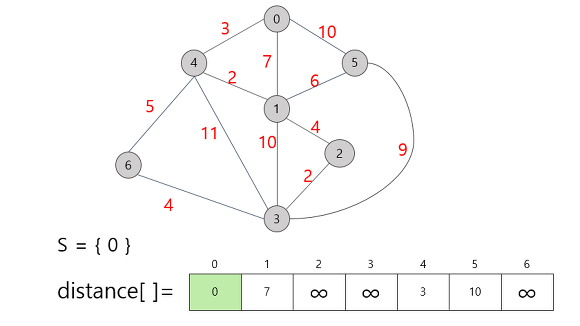

# 그래프2(최단경로 알고리즘 : 다익스트라(Dijkstra), 벨만포드(Bellman-Ford), 플로이드(Floyd-Warshall), SPFA(Shortest Path Faster))

### 관련 문제들

| 링크 | 수민 | 새음  |석렬|
|--|--|--|--|
| [https://www.acmicpc.net/problem/1504](https://www.acmicpc.net/problem/1504)||||
| [https://www.acmicpc.net/problem/1753](https://www.acmicpc.net/problem/1753)||||
| [https://www.acmicpc.net/problem/11403](https://www.acmicpc.net/problem/11403)||||
| [https://www.acmicpc.net/problem/11404](https://www.acmicpc.net/problem/11404)||||
| [https://www.acmicpc.net/problem/11780](https://www.acmicpc.net/problem/11780)||||
| [https://www.acmicpc.net/problem/1389](https://www.acmicpc.net/problem/1389)||||
| [https://www.acmicpc.net/problem/1507](https://www.acmicpc.net/problem/1507)||||
| [https://www.acmicpc.net/problem/1956](https://www.acmicpc.net/problem/1956)||||
| [https://www.acmicpc.net/problem/11657](https://www.acmicpc.net/problem/11657)||||
|||||
|[특정 거리의 도시 찾기](https://www.acmicpc.net/problem/18352)||||
|[경로 찾기](https://www.acmicpc.net/problem/11403)||||
|[최단경로](https://www.acmicpc.net/problem/1753)||||

   

 

## [issue]에 대한 정리

### issue1 : 최단경로 알고리즘

**최단경로 알고리즘**이란 그래프에서 노드간의 최단경로를 찾는 알고리즘이다.

대표적인 최단경로 알고리즘
- BFS
- 다익스트라
- 벨만포드
- 플로이드 와샬

다음 표는 상황에 따라 어떤 알고리즘을 선택해야 하는지에 대한 표이다.

[최단경로 알고리즘 구현 코드](https://sumin416.tistory.com/entry/최단경로-알고리즘)

 

#### issue2 : 다익스트라 알고리즘

   [다익스트라 정리](https://sumin416.tistory.com/entry/다익스트라-알고리즘-Dijkstra-Algorithm)

   -> 출발점에서 나머지 모든 노들 가는 최단거리르 구할 수 있다.
   -> 음의 간선은 불가
   -> 매 순간의 가장 작은 값을 선택하기 때문에 그리디
   -> A->B의 최단경로 + B->C의 최단경로 = A->C의 최단경로 이므로 DP
   
   
    
   <b>필요한 변수</b>
   
   > int[] distance : 시작노드->i번째 노드까지의 최단거리
   > 
   > boolean[] visited : 방문한 노드 체크
   
    
   <b>구현 방법</b>
   
   1. 출발 노드 설정, distance 모드 값 무한대로 초기화
   2. 출발 노드에서 직접 연결된 노드로 가는 가중치로 distance 초기화
   3. 방문하지 않은 노드 중 가장 비용이 적은 노드 선택
   4. 출발노드~선택된노드 + 선택된노드~연결된노드 의 가중치가 distance[연결된노드] 보다 작다면 갱신
   5. 3,4 반복
  
 
 

#### issue2-1 : 힙을 이용한 다익스트라 알고리즘
   
   issue1 구현방법 3에서 N만큼의 배열을 선형탐색 한다면 O(N) : 전체적으로 O(N^2), 노드개수는 많고 간선이 적다면 비효율적
   
   힙을 사용한다면 O(logN)을 만들 수 있다.
   
    
   <b>필요한 변수</b>
   
   > List<int[]>[] edges = new ArrayList[N] : 간선중심으로 그래프 기보 정보 저장
   > 
   >  ex) edges[1].add(new int[] {3,5});  : 노드1 ~노드3의 가중치 5
   
   

   
   
   
   
   

 
 

##### issue3

